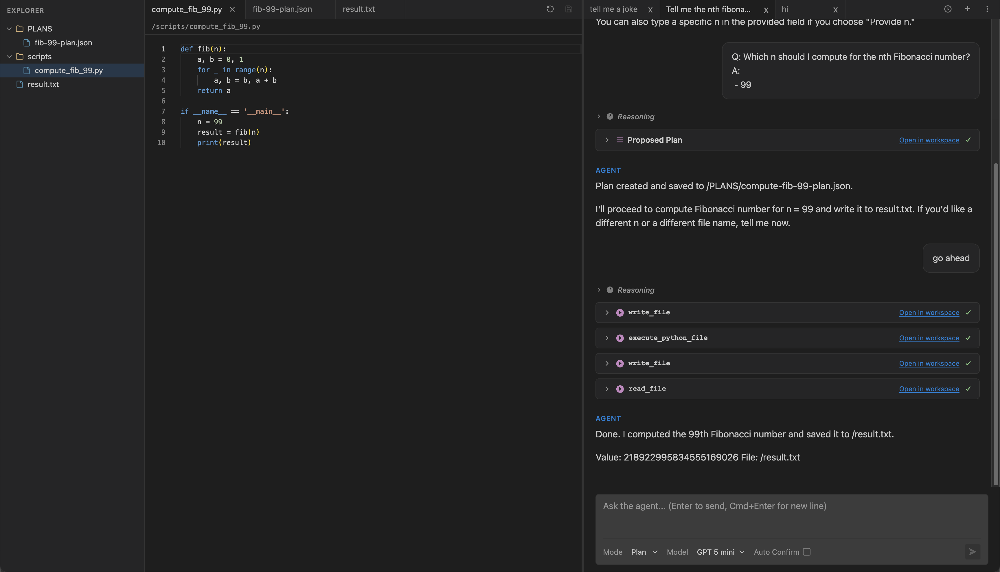
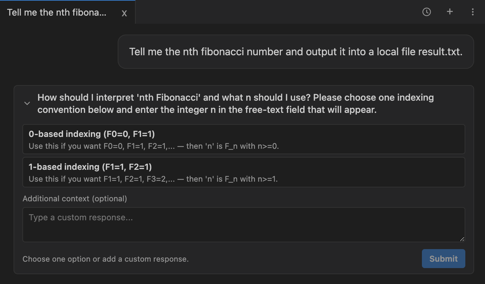
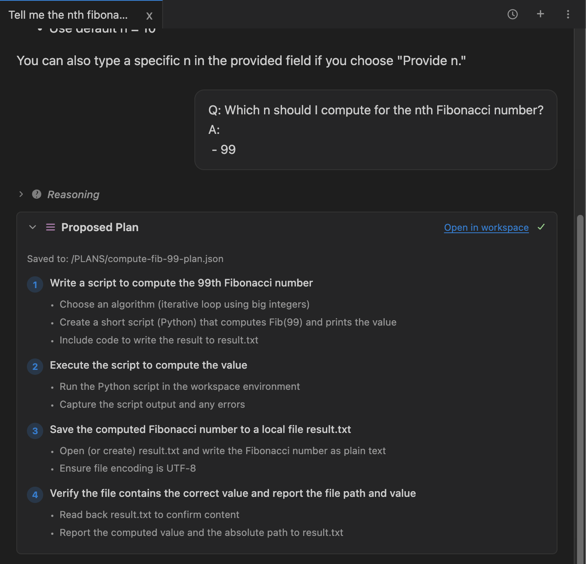

# Sequence

AI chat app with an agentic backend — tool use, multi-turn conversations, resilient streaming.

**Stack:** React + TypeScript (Vite) / Python + FastAPI / PostgreSQL / Redis / OpenAI API

```
├── client/   # React SPA
└── server/   # FastAPI backend
```

## Running

```bash
cd client && npm install && npm run dev
cd server && pip install -e . && uvicorn sequence.main:app --reload
```

## Docs

- [Features](docs/features.md) — what the app does
- [Future Improvements](docs/future_improvements.md) — what I'd change given more time
- [Tool Design](docs/tools.md) — design decisions around agent tools
- [LLM Streaming](docs/llm_stream.md) — streaming architecture, latency, caching
- [Agent System](server/src/sequence/agent/README.md) — threads, sessions, tool registry, approval flow
- [Database](server/src/sequence/database/README.md) — schema, save/load, workspace files

## Screenshots

### Main Page


### Ask User Question
The agent can pause mid-conversation to ask interactive questions with selectable options, descriptions, and free-text input.



### Plan
Structured plans with numbered steps and sub-tasks, saved to the workspace for reference.




